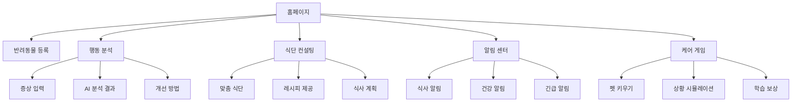

## 1. Product Overview

반려동물의 건강 유지와 예방을 위한 AI 기반 맞춤 케어 자동화 서비스입니다. 행동 분석, 식습관 컨설팅, 알림 시스템을 통해 반려동물의 지속적인 건강 관리를 지원하며, 응급 상황 시 빠른 대응이 가능합니다.

반려동물 보호자들이 전문가 수준의 케어를 받을 수 있도록 하여 반려동물의 삶의 질을 향상시키고, 보호자의 걱정을 줄여주는 서비스입니다.

## 2. Core Features

### 2.1 User Roles

| Role     | Registration Method | Core Permissions                                |
| -------- | ------------------- | ----------------------------------------------- |
| 일반 사용자   | 이메일/소셜 로그인          | 반려동물 정보 등록, 행동 분석, 식단 컨설팅(최대5일), 알림 설정, 게임 이용   |
| 프리미엄 사용자 | 유료 구독               | AI 분석 횟수 무제한, 식단컨설팅(기간 무제한)전문가 상담 연결, 상세 건강 리포트 |

### 2.2 Feature Module

반려동물 맞춤 케어 서비스의 주요 페이지:

1. **홈페이지**: 반려동물 상태 요약, 긴급 알림, 빠른 메뉴 접근, GPS 기반 인근 동물병원 추천(영업시간 및 리뷰수 등 정보 제공)
2. **반려동물 등록**: 기본 정보 입력, 건강 상태 기록, 생애주기 설정
3. **행동 분석**: 증상 입력, AI 분석 결과 및 행동 원인 기록, 개선 방법 제시
4. **식단 컨설팅**: 맞춤 식단 추천, 레시피 제공, 식사 시간 설정
5. **알림 센터**: 식사/간식/산책/빗질/맞춤 케어 알림, 건강 체크 알림, 긴급 상황 알림
6. **케어 게임**: 반려동물 키우기 시뮬레이션, 상황 대응 학습, 서비스 내 맞춤 식당 급여로 반려동물 영양 및 활력 지수 확인(ex. \~기관에 좋음)
7. **마이페이지**: 반려동물 정보 관리, 분석 히스토리, 설정

### 2.3 Page Details

| Page Name | Module Name | Feature description                                                         |
| --------- | ----------- | --------------------------------------------------------------------------- |
| 홈페이지      | 상태 대시보드     | 반려동물의 오늘 상태, 긴급도 높은 알림 표시, 주요 지표 요약, GPS 기반 인근 동물병원 정보 제공                   |
| 홈페이지      | 퀵 액션        | 행동 분석 바로가기, 식단 추천, 긴급 상황 신고 버튼                                              |
| 반려동물 등록   | 기본 정보       | 이름, 종류, 품종, 나이, 체중, 중성화 여부, 제일 최근 건강검진 일정, 평균적인 일일 활동 및 케어 스케줄, 반려동물등록번호 입력 |
| 반려동물 등록   | 건강 정보       | 알레르기, 질병 이력(수술 포함), 현재 약물 복용 중인 내용 기록                                       |
| 행동 분석     | 증상 입력       | 행동 변화, 식습관 변화, 신체 증상 등 다양한 항목 선택/입력                                         |
| 행동 분석     | AI 분석 결과    | 가능한 원인 제시, 긴급도 표시, 전문의 상담 권장 여부                                             |
| 행동 분석     | 개선 방법       | 환경 개선, 식단 조절, 운동량 조절 등 구체적인 방안 제시                                           |
| 식단 컨설팅    | 맞춤 식단       | 생애주기별, 건강 상태별 최적의 식단(식사/간식) 추천                                              |
| 식단 컨설팅    | 레시피 제공      | 조리법, 영양 성분, 조리 예상 시간, 난이도 정보 제공                                             |
| 식단 컨설팅    | 식사 계획       | 일간/주간/월간 식단표 작성, 식사 시간 설정                                                   |
| 알림 센터     | 식사 알림       | 설정한 시간에 식사/간식 알림 푸시 알림 전송                                                   |
| 알림 센터     | 건강 알림       | 정기적인 건강 체크 알림, 예방 접종 일정 알림                                                  |
| 알림 센터     | 긴급 알림       | 위험 증상 감지 시 즉시 알림 및 대처법 안내                                                   |
| 케어 게임     | 펫 키우기       | 가상 반려동물 키우기, 성장 단계별 돌봄 학습                                                   |
| 케어 게임     | 상황 시뮬레이션    | 질병, 응급상황, 행동문제 등 다양한 시나리오 체험                                                |
| 케어 게임     | 학습 보상       | 게임 진행 시 실제 케어 팁 획득, 업적 시스템                                                  |
| 마이페이지     | 펫 정보 관리     | 등록된 반려동물 정보 수정, 추가 등록                                                       |
| 마이페이지     | 분석 히스토리     | 과거 행동 분석 기록, 건강 변화 추이 그래프                                                   |
| 마이페이지     | 설정          | 알림 설정, 언어 설정, 계정 관리                                                         |

## 3. Core Process

### 일반 사용자 플로우

1. 회원가입 후 반려동물 기본 정보 등록
2. 홈페이지에서 반려동물 상태 확인
3. 행동 이상 징후 발견 시 행동 분석 페이지에서 증상 입력
4. AI 분석 결과 확인 및 개선 방법 적용
5. 식단 컨설팅 페이지에서 맞춤 식단 확인 및 레시피 활용
6. 알림 설정을 통한 규칙적인 식사 관리
7. 케어 게임을 통한 반려동물 돌봄 역량 강화

### 긴급 상황 플로우

1. 긴급 증상 입력 시 즉시 위험도 평가
2. 높은 위험도 시 즉시 근처 동물병원 정보 제공 및 전화 연결 안내
3. 응급 처치 방법 실시간 안내
4. 사후 관리 및 예방 방안 제시

## 4. User Interface Design

### 4.1 Design Style

* **주요 색상**: 따뜻한 파스텔 톤 (민트색 #A8E6CF, 코랄색 #FF8B94, 크림색 #FFF5E6)

* **버튼 스타일**: 둥근 모서리의 친근한 디자인, 그림자 효과로 입체감 부여

* **폰트**: 둥근고딕 계열, 주요 텍스트 16px, 제목 24-32px

* **레이아웃**: 카드 기반 디자인, 일관된 여백과 간격

* **아이콘/이모지**: 귀여운 캐릭터 스타일의 일러스트, 부드러운 라인 아이콘

### 4.2 Page Design Overview

| Page Name | Module Name | UI Elements                                       |
| --------- | ----------- | ------------------------------------------------- |
| 홈페이지      | 상태 대시보드     | 둥근 카드에 반려동물 사진과 상태 표시, 민트색 배경의 건강 지표 위젯           |
| 홈페이지      | 퀵 액션        | 파스텔 색상의 큰 버튼, 아이콘과 함께 직관적인 메뉴 배치                  |
| 반려동물 등록   | 정보 입력       | 단계별 진행 바, 하트 아이콘으로 중요도 표시, 부드러운 애니메이션 전환          |
| 행동 분석     | 증상 선택       | 그리드 레이아웃의 증상 카드, 선택 시 하이라이트 효과, 코랄색 강조            |
| 행동 분석     | 결과 표시       | 위험도에 따른 색상 코딩 (녹색-안전, 노랑-주의, 빨강-위험), 확장 가능한 결과 카드 |
| 식단 컨설팅    | 레시피 카드      | 음식 사진, 조리 시간 아이콘, 난이도 별 표시, 호버 시 확대 효과            |
| 알림 센터     | 알림 목록       | 시간순 정렬, 읽음/안읽음 구분, 긴급도에 따른 아이콘 변화                 |
| 케어 게임     | 게임 화면       | 귀여운 2D 캐릭터, 애니메이션 효과, 진행 상황 바, 코인/포인트 표시          |

### 4.3 Responsiveness

* 데스크톱 우선 설계 (Desktop-first)

* 태블릿 및 모바일 반응형 지원 (768px, 480px 브레이크포인트)

* 터치 최적화: 클릭 영역 최소 44px, 스와이프 제스처 지원

* 모바일에서는 하단 네비게이션 바로 메뉴 접근성 향상

### 4.4 Character Design Guidance

* 귀엽고 부드러운 라인의 캐릭터 디자인

* 다양한 감정 표현 (행복, 걱정, 아픔, 배고픔 등)

* 애니메이션: 호버 시 귀여운 움직임, 깜빡임 효과

* 일관된 캐릭터 스타일로 모든 페이지에서 통일감 부여

