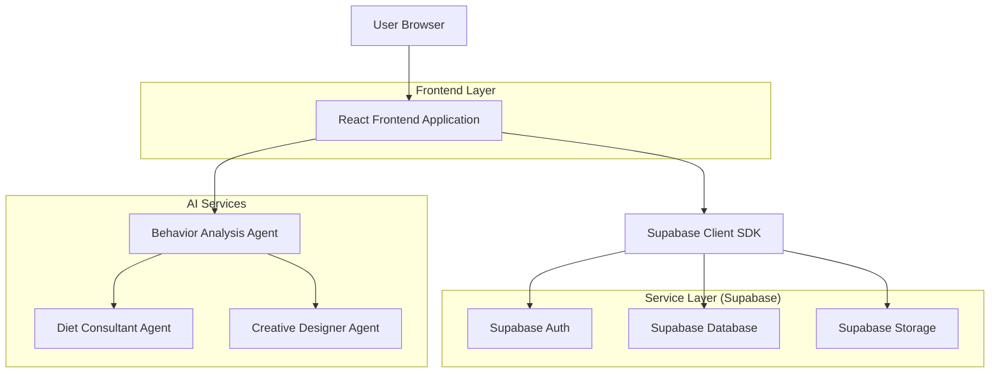
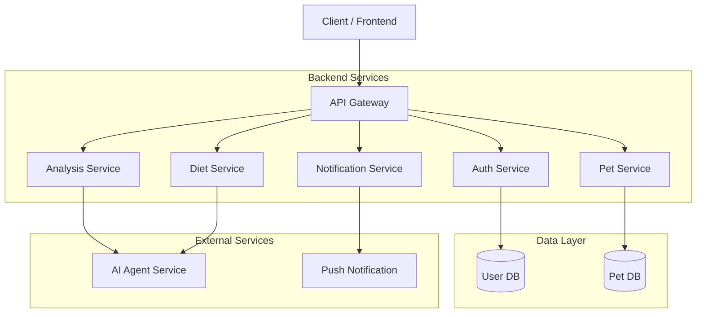
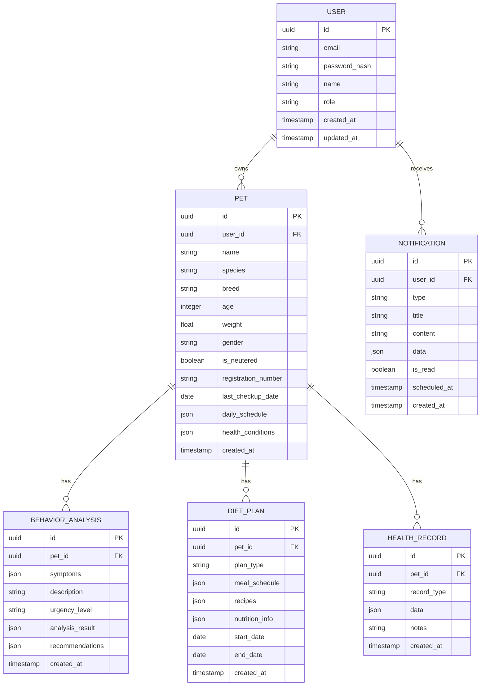

## 1. Architecture design



## 2. Technology Description
- Frontend: React@18 + tailwindcss@3 + vite
- Initialization Tool: vite-init
- Backend: Supabase (BaaS)
- AI Integration: Custom API endpoints for agent services
- Notification: Web Push API + Supabase Realtime
- Game Engine: Canvas API + CSS Animations

## 3. Route definitions
| Route | Purpose |
|-------|---------|
| / | 홈페이지, 반려동물 상태 대시보드, 주변 병원 정보 |
| /login | 로그인 페이지 |
| /register | 회원가입 페이지 |
| /pet/register | 반려동물 정보 등록 |
| /pet/profile | 반려동물 프로필 관리 |
| /analysis/behavior | 행동 분석 입력 및 결과 |
| /consulting/diet | 식단 컨설팅 및 레시피 |
| /notifications | 알림 센터 |
| /game/care | 케어 시뮬레이션 게임 |
| /hospitals | 주변 동물병원 목록 및 상세 |
| /settings | 설정 페이지 |

## 4. API definitions

### 4.1 Authentication APIs
```
POST /api/auth/register
```
Request:
| Param Name | Param Type | isRequired | Description |
|------------|-------------|-------------|-------------|
| email | string | true | 사용자 이메일 |
| password | string | true | 비밀번호 |
| name | string | true | 사용자 이름 |

Response:
| Param Name | Param Type | Description |
|------------|-------------|-------------|
| user | object | 사용자 정보 |
| session | object | 인증 세션 |

### 4.2 Pet Management APIs
```
POST /api/pets/register
```
Request:
| Param Name | Param Type | isRequired | Description |
|------------|-------------|-------------|-------------|
| name | string | true | 반려동물 이름 |
| species | string | true | 종류 (개/고양이/기타) |
| breed | string | true | 품종 |
| age | number | true | 나이 |
| weight | number | true | 체중 |
| gender | string | true | 성별 |
| registrationNumber | string | false | 반려동물 등록번호 |
| lastCheckupDate | string | false | 최근 건강검진 일정 (YYYY-MM-DD) |
| dailySchedule | object | false | 일일 활동 및 케어 스케줄 |

### 4.3 Behavior Analysis APIs
```
POST /api/analysis/behavior
```
Request:
| Param Name | Param Type | isRequired | Description |
|------------|-------------|-------------|-------------|
| petId | string | true | 반려동물 ID |
| symptoms | array | true | 증상 목록 |
| behaviorChanges | string | false | 행동 변화 설명 |
| duration | number | true | 증상 지속 기간 |

Response:
| Param Name | Param Type | Description |
|------------|-------------|-------------|
| analysis | object | AI 분석 결과 |
| urgency | string | 긴급도 (low/medium/high) |
| recommendations | array | 개선 방법 목록 |

### 4.4 Diet Consulting APIs
```
POST /api/consulting/diet
```
Request:
| Param Name | Param Type | isRequired | Description |
|------------|-------------|-------------|-------------|
| petId | string | true | 반려동물 ID |
| period | string | true | 기간 (daily/weekly/monthly) |
| preferences | array | false | 선호 식품 |
| allergies | array | false | 알레르기 식품 |

Response:
| Param Name | Param Type | Description |
|------------|-------------|-------------|
| mealPlan | object | 식단 계획 |
| recipes | array | 레시피 목록 |
| nutrition | object | 영양 정보 |

## 5. Server architecture diagram



## 6. Data model

### 6.1 Data model definition


### 6.2 Data Definition Language

User Table (users)
```sql
-- create table
CREATE TABLE users (
  id UUID PRIMARY KEY DEFAULT gen_random_uuid(),
  email VARCHAR(255) UNIQUE NOT NULL,
  password_hash VARCHAR(255) NOT NULL,
  name VARCHAR(100) NOT NULL,
  role VARCHAR(20) DEFAULT 'user' CHECK (role IN ('user', 'premium')),
  created_at TIMESTAMP WITH TIME ZONE DEFAULT NOW(),
  updated_at TIMESTAMP WITH TIME ZONE DEFAULT NOW()
);

-- create index
CREATE INDEX idx_users_email ON users(email);

-- grant permissions
GRANT SELECT ON users TO anon;
GRANT ALL PRIVILEGES ON users TO authenticated;
```

Pet Table (pets)
```sql
-- create table
CREATE TABLE pets (
  id UUID PRIMARY KEY DEFAULT gen_random_uuid(),
  user_id UUID REFERENCES users(id) ON DELETE CASCADE,
  name VARCHAR(100) NOT NULL,
  species VARCHAR(50) NOT NULL CHECK (species IN ('dog', 'cat', 'other')),
  breed VARCHAR(100) NOT NULL,
  age INTEGER NOT NULL CHECK (age > 0),
  weight DECIMAL(5,2) NOT NULL CHECK (weight > 0),
  gender VARCHAR(10) NOT NULL CHECK (gender IN ('male', 'female')),
  is_neutered BOOLEAN DEFAULT FALSE,
  registration_number VARCHAR(50),
  last_checkup_date DATE,
  daily_schedule JSONB DEFAULT '{}',
  health_conditions JSONB DEFAULT '[]',
  created_at TIMESTAMP WITH TIME ZONE DEFAULT NOW(),
  updated_at TIMESTAMP WITH TIME ZONE DEFAULT NOW()
);

-- create index
CREATE INDEX idx_pets_user_id ON pets(user_id);

-- grant permissions
GRANT SELECT ON pets TO anon;
GRANT ALL PRIVILEGES ON pets TO authenticated;
```

Behavior Analysis Table (behavior_analyses)
```sql
-- create table
CREATE TABLE behavior_analyses (
  id UUID PRIMARY KEY DEFAULT gen_random_uuid(),
  pet_id UUID REFERENCES pets(id) ON DELETE CASCADE,
  symptoms JSONB NOT NULL,
  description TEXT,
  urgency_level VARCHAR(20) NOT NULL CHECK (urgency_level IN ('low', 'medium', 'high')),
  analysis_result JSONB NOT NULL,
  recommendations JSONB NOT NULL,
  created_at TIMESTAMP WITH TIME ZONE DEFAULT NOW()
);

-- create index
CREATE INDEX idx_behavior_analyses_pet_id ON behavior_analyses(pet_id);
CREATE INDEX idx_behavior_analyses_created_at ON behavior_analyses(created_at DESC);

-- grant permissions
GRANT SELECT ON behavior_analyses TO anon;
GRANT ALL PRIVILEGES ON behavior_analyses TO authenticated;
```

Diet Plans Table (diet_plans)
```sql
-- create table
CREATE TABLE diet_plans (
  id UUID PRIMARY KEY DEFAULT gen_random_uuid(),
  pet_id UUID REFERENCES pets(id) ON DELETE CASCADE,
  plan_type VARCHAR(50) NOT NULL,
  meal_schedule JSONB NOT NULL,
  recipes JSONB NOT NULL,
  nutrition_info JSONB NOT NULL,
  start_date DATE NOT NULL,
  end_date DATE NOT NULL,
  created_at TIMESTAMP WITH TIME ZONE DEFAULT NOW()
);

-- create index
CREATE INDEX idx_diet_plans_pet_id ON diet_plans(pet_id);
CREATE INDEX idx_diet_plans_date_range ON diet_plans(start_date, end_date);

-- grant permissions
GRANT SELECT ON diet_plans TO anon;
GRANT ALL PRIVILEGES ON diet_plans TO authenticated;
```

Notifications Table (notifications)
```sql
-- create table
CREATE TABLE notifications (
  id UUID PRIMARY KEY DEFAULT gen_random_uuid(),
  user_id UUID REFERENCES users(id) ON DELETE CASCADE,
  type VARCHAR(50) NOT NULL,
  title VARCHAR(200) NOT NULL,
  content TEXT NOT NULL,
  data JSONB,
  is_read BOOLEAN DEFAULT FALSE,
  scheduled_at TIMESTAMP WITH TIME ZONE,
  created_at TIMESTAMP WITH TIME ZONE DEFAULT NOW()
);

-- create index
CREATE INDEX idx_notifications_user_id ON notifications(user_id);
CREATE INDEX idx_notifications_is_read ON notifications(is_read);
CREATE INDEX idx_notifications_scheduled_at ON notifications(scheduled_at);

-- grant permissions
GRANT SELECT ON notifications TO anon;
GRANT ALL PRIVILEGES ON notifications TO authenticated;
```